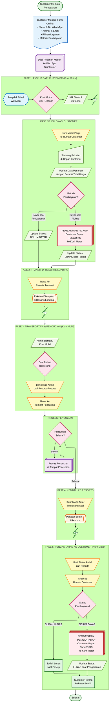

```mermaid
---
config:
  look: classic
  theme: forest
  layout: elk
---
flowchart TB
 subgraph Phase1["FASE 1: PICKUP DARI CUSTOMER (Kurir Motor)"]
    direction LR
        TabelPesanan["Tampil di Tabel<br>Web App"]
        KurirCek{"Kurir Motor<br>Cek Pesanan"}
        WaMe["Klik Tombol<br>wa.to.me"]
        Konfirmasi["Konfirmasi &<br>Request Location"]
  end
 subgraph Phase1b["FASE 1B: DI LOKASI CUSTOMER"]
    direction TB
        Pickup["Kurir Motor Pergi<br>ke Rumah Customer"]
        Timbang["Timbang Pakaian<br>di Depan Customer"]
        UpdateBerat["Update Data Pesanan<br>dengan Berat & Total Harga"]
        CekBayar1{"Metode<br>Pembayaran?"}
        BayarPickup["PEMBAYARAN PICKUP<br>Customer Bayar Tunai/QRIS<br>ke Kurir Motor"]
        UpdateStatus1["Update Status:<br>LUNAS saat Pickup"]
        TandaiNanti["Update Status:<br>BELUM BAYAR"]
  end
 subgraph Phase2["FASE 2: TRANSIT DI RESORTS LOADING"]
    direction LR
        BawaKeResorts["Bawa ke<br>Resorts Terdekat"]
        PakaianDiResorts["Pakaian Disimpan<br>di Resorts Loading"]
        NotifAdmin["Notifikasi<br>ke Admin"]
  end
 subgraph Phase3["FASE 3: TRANSPORTASI & PENCUCIAN (Kurir Mobil)"]
    direction TB
        AdminInform["Admin Beritahu<br>Kurir Mobil"]
        JadwalMobil{"Cek Jadwal<br>Berkeliling"}
        PickupResorts["Berkeliling Ambil<br>dari Resorts-Resorts"]
        BawaLaundry["Bawa ke<br>Tempat Pencucian"]
  end
 subgraph Phase3b["PROSES PENCUCIAN"]
    direction LR
        Cuci["Proses Pencucian<br>di Tempat Pencucian"]
        Selesai{"Pencucian<br>Selesai?"}
  end
 subgraph Phase4["FASE 4: KEMBALI KE RESORTS"]
    direction LR
        KirimBalik["Kurir Mobil Antar<br>ke Resorts Asal"]
        PakaianKembali["Pakaian Bersih<br>di Resorts"]
        NotifKurirMotor["Notifikasi<br>Kurir Motor"]
  end
 subgraph Phase5["FASE 5: PENGANTARAN KE CUSTOMER (Kurir Motor)"]
    direction TB
        AmbilBersih["Kurir Motor Ambil<br>dari Resorts"]
        AntarCustomer["Antar ke<br>Rumah Customer"]
        CekBayar2{"Status<br>Pembayaran?"}
        BayarAntar["PEMBAYARAN PENGANTARAN<br>Customer Bayar Tunai/QRIS<br>ke Kurir Motor"]
        UpdateStatus2["Update Status:<br>LUNAS saat Pengantaran"]
        SudahLunas["Sudah Lunas<br>saat Pickup"]
        Terima["Customer Terima<br>Pakaian Bersih"]
  end
    Start(["Customer Memulai<br>Pemesanan"]) --> FormOrder["Customer Mengisi Form Online:<br>• Nama & No WhatsApp<br>• Alamat & Email<br>• Pilihan Layanan<br>• Metode Pembayaran"]
    FormOrder --> DataMasuk["Data Pesanan Masuk<br>ke Web App<br>Kurir Motor"]
    TabelPesanan --> KurirCek
    KurirCek --> WaMe
    WaMe --> Konfirmasi
    DataMasuk --> Phase1
    Pickup --> Timbang
    Timbang --> UpdateBerat
    UpdateBerat --> CekBayar1
    CekBayar1 -- Bayar saat<br>Pickup --> BayarPickup
    CekBayar1 -- Bayar saat<br>Pengantaran --> TandaiNanti
    BayarPickup --> UpdateStatus1
    Phase1 --> Phase1b
    BawaKeResorts --> PakaianDiResorts
    PakaianDiResorts --> NotifAdmin
    UpdateStatus1 --> Phase2
    TandaiNanti --> Phase2
    AdminInform --> JadwalMobil
    JadwalMobil --> PickupResorts
    PickupResorts --> BawaLaundry
    Phase2 --> Phase3
    Cuci --> Selesai
    Selesai -- Belum --> Cuci
    Phase3 --> Phase3b
    KirimBalik --> PakaianKembali
    PakaianKembali --> NotifKurirMotor
    Selesai -- Selesai --> Phase4
    AmbilBersih --> AntarCustomer
    AntarCustomer --> CekBayar2
    CekBayar2 -- BELUM BAYAR --> BayarAntar
    CekBayar2 -- SUDAH LUNAS --> SudahLunas
    BayarAntar --> UpdateStatus2
    UpdateStatus2 --> Terima
    SudahLunas --> Terima
    Phase4 --> Phase5
    Phase5 --> End(["Selesai"])
    TabelPesanan@{ shape: curv-trap}
    WaMe@{ shape: lean-r}
    Konfirmasi@{ shape: bolt}
    Pickup@{ shape: manual}
    Timbang@{ shape: sl-rect}
    UpdateBerat@{ shape: lean-r}
    BayarPickup@{ shape: procs}
    UpdateStatus1@{ shape: lean-r}
    TandaiNanti@{ shape: lean-r}
    BawaKeResorts@{ shape: manual}
    PakaianDiResorts@{ shape: das}
    NotifAdmin@{ shape: bolt}
    AdminInform@{ shape: lean-r}
    PickupResorts@{ shape: manual}
    BawaLaundry@{ shape: manual}
    Cuci@{ shape: procs}
    KirimBalik@{ shape: manual}
    PakaianKembali@{ shape: das}
    NotifKurirMotor@{ shape: bolt}
    AmbilBersih@{ shape: manual}
    AntarCustomer@{ shape: manual}
    BayarAntar@{ shape: procs}
    UpdateStatus2@{ shape: lean-r}
    SudahLunas@{ shape: rounded}
    Terima@{ shape: rounded}
    FormOrder@{ shape: doc}
    DataMasuk@{ shape: procs}
     TabelPesanan:::display
     KurirCek:::decision
     WaMe:::input
     Konfirmasi:::communication
     Pickup:::manual
     Timbang:::input
     UpdateBerat:::input
     CekBayar1:::decision
     BayarPickup:::process
     BayarPickup:::payment
     UpdateStatus1:::input
     TandaiNanti:::input
     BawaKeResorts:::manual
     PakaianDiResorts:::storage
     NotifAdmin:::communication
     AdminInform:::input
     JadwalMobil:::decision
     PickupResorts:::manual
     BawaLaundry:::manual
     Cuci:::process
     Selesai:::decision
     KirimBalik:::manual
     PakaianKembali:::storage
     NotifKurirMotor:::communication
     AmbilBersih:::manual
     AntarCustomer:::manual
     CekBayar2:::decision
     BayarAntar:::process
     BayarAntar:::payment
     UpdateStatus2:::input
     SudahLunas:::startEnd
     Terima:::startEnd
     Start:::startEnd
     FormOrder:::document
     DataMasuk:::process
     End:::startEnd
    classDef startEnd fill:#e1f5e1,stroke:#2e7d32,stroke-width:3px
    classDef document fill:#e3f2fd,stroke:#1565c0,stroke-width:2px
    classDef process fill:#f3e5f5,stroke:#6a1b9a,stroke-width:2px
    classDef storage fill:#fff3e0,stroke:#e65100,stroke-width:2px
    classDef communication fill:#e8f5e9,stroke:#2e7d32,stroke-width:2px
    classDef manual fill:#fff9c4,stroke:#f57f17,stroke-width:2px
    classDef decision fill:#fce4ec,stroke:#c2185b,stroke-width:2px
    classDef display fill:#e1f5fe,stroke:#0277bd,stroke-width:2px
    classDef input fill:#f1f8e9,stroke:#558b2f,stroke-width:2px
    classDef payment fill:#ffebee,stroke:#b71c1c,stroke-width:3px
```
