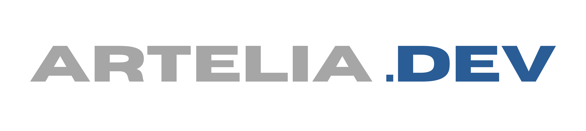

<p align="center">
  
</p>

<h1 align="center">Main Laundry</h1>

<p align="center">
  Sistem manajemen laundry berbasis web yang dibangun dengan Laravel, Livewire, dan Mary UI.<br>
  Aplikasi ini menyediakan landing page untuk pelanggan dan akan dilengkapi dengan panel admin menggunakan Filament PHP.
</p>

<p align="center">
  <strong>Developed by Main Tim</strong>
</p>

<p align="center">
  
  
  
  
</p>

<p align="center">
  
  
  
</p>

## Tech Stack

### Backend
- **Laravel 12** - PHP Framework
- **Livewire 3** - Full-stack framework untuk Laravel
- **Filament PHP** *(Coming Soon)* - Admin panel framework

### Frontend
- **Mary UI** - Component library untuk Livewire (berbasis DaisyUI)
- **DaisyUI** - Tailwind CSS component library
- **Tailwind CSS** - Utility-first CSS framework
- **AOS.js** - Animate On Scroll library

### Database
- MySQL / PostgreSQL / SQLite

## Features

### Landing Page (Completed ✓)
- [x] **Beranda** - Hero section dengan stats dan customer review
- [x] **Layanan** - Grid bento menampilkan berbagai layanan laundry
- [x] **Harga** - Paket harga untuk setiap layanan
- [x] **Promo** - Membership packages dan promo spesial
- [x] **FAQ** - Frequently Asked Questions
- [x] **Tentang** - Informasi tentang perusahaan, visi, misi
- [x] **Testimoni** - Customer testimonials dengan horizontal scroll
- [x] **Lokasi** - Google Maps embed dan informasi kontak
- [x] **Reservasi** - Form booking layanan laundry

### Admin Panel (Coming Soon)
- [ ] Dashboard analytics
- [ ] Manajemen pesanan
- [ ] Manajemen pelanggan
- [ ] Manajemen layanan & harga
- [ ] Manajemen promo
- [ ] Laporan keuangan

## Installation

### Requirements
- PHP >= 8.3
- Composer
- Node.js & NPM
- MySQL/PostgreSQL/SQLite

### Setup

1. Clone repository
```bash
git clone <repository-url>
cd main-laundry
```

2. Install dependencies
```bash
composer install
npm install
```

3. Copy environment file
```bash
cp .env.example .env
```

4. Generate application key
```bash
php artisan key:generate
```

5. Configure database di `.env`
```env
DB_CONNECTION=mysql
DB_HOST=127.0.0.1
DB_PORT=3306
DB_DATABASE=main_laundry
DB_USERNAME=root
DB_PASSWORD=
```

6. Run migrations
```bash
php artisan migrate
```

7. Build assets
```bash
npm run build
# atau untuk development
npm run dev
```

8. Start development server
```bash
php artisan serve
```

Aplikasi akan berjalan di `http://localhost:8000`

## Project Structure

```
main-laundry/
├── app/
│   └── Livewire/
│       └── LandingPage/
│           ├── Beranda.php
│           ├── Layanan.php
│           ├── Harga.php
│           ├── Promo.php
│           ├── Faq.php
│           ├── Tentang.php
│           ├── Testimoni.php
│           ├── Lokasi.php
│           └── Reservasi.php
├── resources/
│   ├── css/
│   │   ├── app.css
│   │   ├── daisyui.css
│   │   └── maryui.css
│   └── views/
│       ├── index.blade.php
│       └── livewire/
│           └── landing-page/
│               ├── beranda.blade.php
│               ├── layanan.blade.php
│               ├── harga.blade.php
│               ├── promo.blade.php
│               ├── faq.blade.php
│               ├── tentang.blade.php
│               ├── testimoni.blade.php
│               ├── lokasi.blade.php
│               └── reservasi.blade.php
└── package.json
```

## Development

### Running Development Server
```bash
# Terminal 1 - Laravel
php artisan serve

# Terminal 2 - Vite (for hot reload)
npm run dev
```

### Building for Production
```bash
npm run build
```

### Code Style
Project ini menggunakan:
- PSR-12 untuk PHP
- Prettier untuk JavaScript/CSS

## Components

### Mary UI Components Used
- `x-card` - Card container
- `x-button` - Button components
- `x-input` - Text input fields
- `x-select` - Select dropdown
- `x-textarea` - Textarea fields
- `x-checkbox` - Checkbox inputs
- `x-datetime` - DateTime picker
- `x-form` - Form wrapper
- `x-rating` - Star rating display
- `x-badge` - Badge labels
- `x-stat` - Statistics display
- `x-collapse` - Collapsible sections
- `x-icon` - Icon components (using Material Design Icons)

### Custom Features
- Smooth scroll navigation
- AOS animations (optimized for mobile)
- Horizontal scroll testimonials
- Responsive design (mobile-first)
- Custom scrollbar hiding (`.no-scrollbar`)

## Configuration

### Tailwind CSS
Konfigurasi ada di `tailwind.config.js` dengan custom theme untuk DaisyUI.

### AOS Animation
Durasi dan delay sudah dioptimasi untuk performa mobile:
- Duration: 600ms (default)
- Duration: 500ms (cards)
- Delays: 100ms, 200ms, 300ms, 400ms

## Database Schema (Planning)

*Coming soon - akan ditambahkan saat implementasi Filament*

## API Endpoints (Planning)

*Coming soon - akan ditambahkan untuk mobile app integration*

## Contributing

Jika ingin berkontribusi:
1. Fork repository
2. Create feature branch (`git checkout -b feature/AmazingFeature`)
3. Commit changes (`git commit -m 'Add some AmazingFeature'`)
4. Push to branch (`git push origin feature/AmazingFeature`)
5. Open Pull Request

## License

This project is private and proprietary.

## Author

<p align="center">
  
</p>

**Denis Djodian Ardika**
Full Stack Developer

Dibuat untuk **Main Tim** - Tim profesional dalam pengembangan solusi digital untuk bisnis laundry.

## Credits

### Frameworks & Libraries
- Laravel Framework - [laravel.com](https://laravel.com)
- Livewire - [livewire.laravel.com](https://livewire.laravel.com)
- Mary UI - [mary-ui.com](https://mary-ui.com)
- DaisyUI - [daisyui.com](https://daisyui.com)
- Tailwind CSS - [tailwindcss.com](https://tailwindcss.com)
- AOS - [michalsnik.github.io/aos](https://michalsnik.github.io/aos)
- Material Design Icons - [pictogrammers.com](https://pictogrammers.com/library/mdi/)

### Team
- **Developer:** Denis Djodian Ardika
- **Organization:** Main Tim

---

<p align="center">
  <strong>Main Tim © 2025</strong><br>
  Developed with ❤️ by Denis Djodian Ardika
</p>

**Note:** Project ini masih dalam tahap development. Admin panel dengan Filament PHP akan segera ditambahkan.
